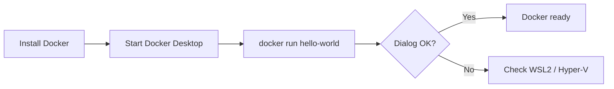
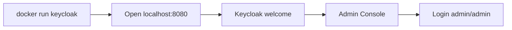
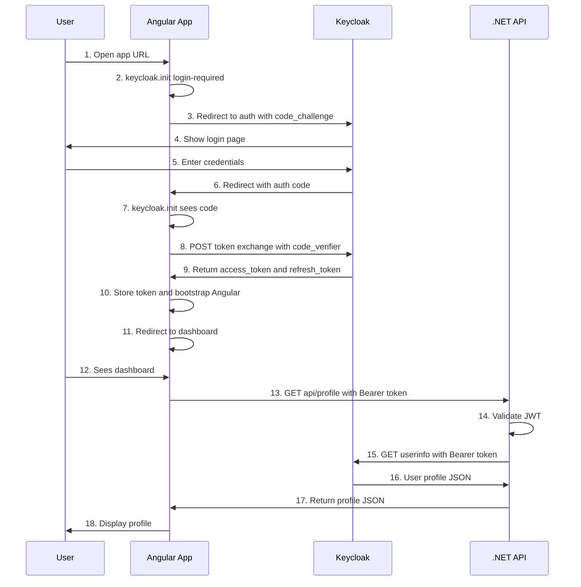
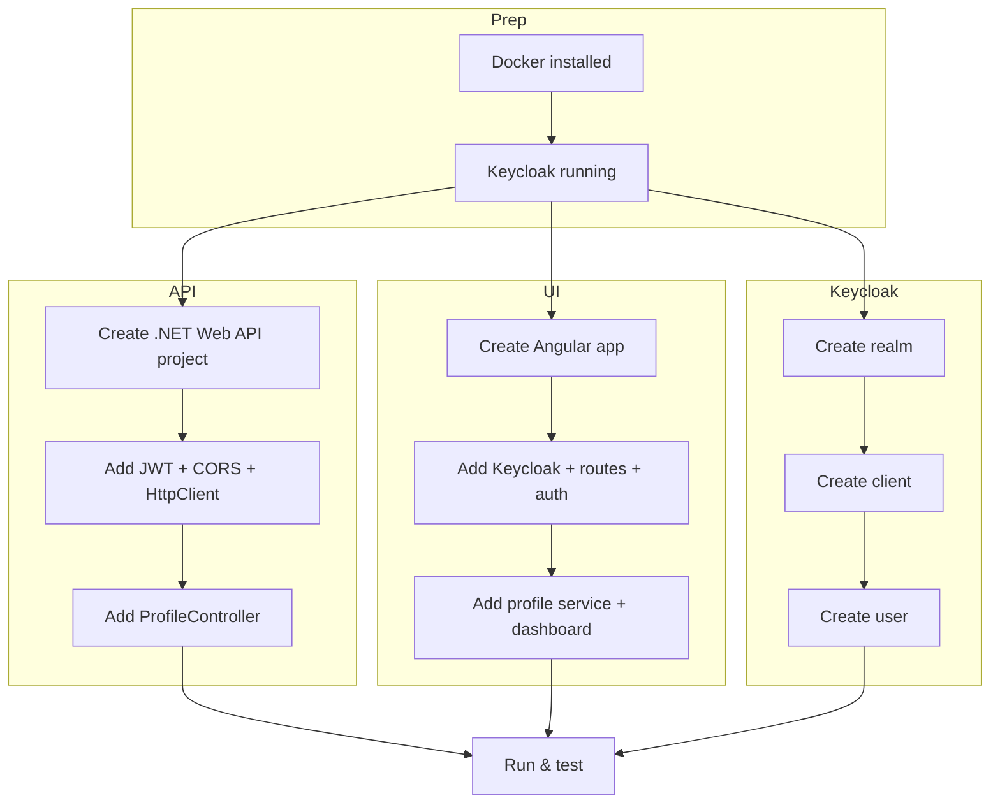
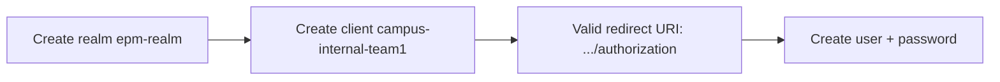
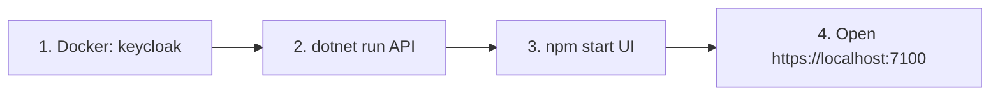
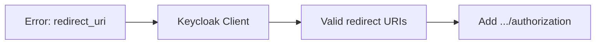
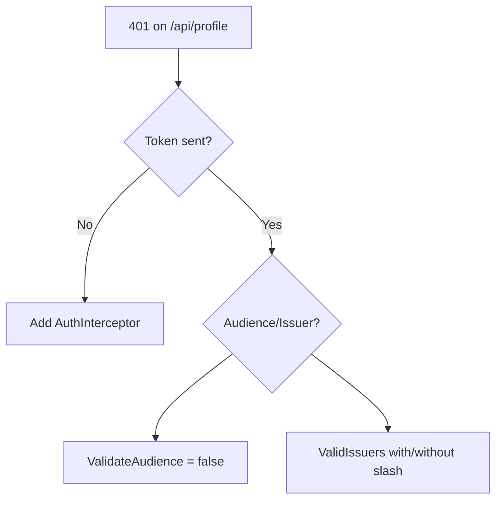
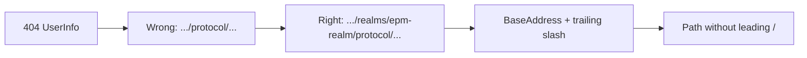

# End-to-End Setup: Angular + .NET Web API + Keycloak (Authorization Code Flow)

This document helps a new developer implement a sample **Angular** UI and **.NET Web API** secured with **Keycloak** using the **Authorization Code flow with PKCE** on a Windows machine. By the end, you will understand SSO/authorization code flow and have a working sample you can run and extend.

---

## Table of Contents

1. [Overview](#1-overview)
2. [Prerequisites](#2-prerequisites)
3. [Docker on Windows](#3-docker-on-windows)
4. [Keycloak Installation and Run](#4-keycloak-installation-and-run)
5. [Authorization Code Flow (Sequence Diagram)](#5-authorization-code-flow-sequence-diagram)
6. [Implementation Steps Overview](#6-implementation-steps-overview)
7. [Step 1: Create .NET Web API](#7-step-1-create-net-web-api)
8. [Step 2: Create Angular UI](#8-step-2-create-angular-ui)
9. [Step 3: Keycloak Configuration](#9-step-3-keycloak-configuration)
10. [Step 4: API Code (All Files)](#10-step-4-api-code-all-files)
11. [Step 5: UI Code (All Files)](#11-step-5-ui-code-all-files)
12. [Run Instructions](#12-run-instructions)
13. [Test Instructions](#13-test-instructions)
14. [FAQ: Issues Encountered and Fixes](#14-faq-issues-encountered-and-fixes)

---

## 1. Overview

| Component        | Technology        | URL (dev)                  | Purpose                          |
|-----------------|-------------------|----------------------------|----------------------------------|
| **UI**          | Angular 16        | https://localhost:7100     | SPA; login via Keycloak, call API |
| **API**         | .NET 9 Web API    | https://localhost:7095    | Protected profile endpoint; fetches user from Keycloak |
| **Identity**    | Keycloak          | http://localhost:8080     | Realm, client, users; issues tokens |

**Flow in one sentence:** User opens the Angular app → redirected to Keycloak login → after login, Keycloak redirects back with an authorization code → Angular (keycloak-js) exchanges the code for tokens → Angular stores the access token and calls the .NET API with it → API validates the JWT and fetches profile from Keycloak UserInfo.

---

## 2. Prerequisites

- **Windows 10/11** (64-bit)
- **Node.js** 18+ and **npm** (for Angular)
- **.NET 9 SDK** (for Web API)
- **Docker** (for Keycloak; see next section)
- **Git** (optional, for cloning)

Ensure these work in a terminal:

```powershell
node -v
npm -v
dotnet --version
docker --version
```

---

## 3. Docker on Windows

Docker is used to run Keycloak. You can use **Docker Desktop** or **Docker without Desktop** (e.g. WSL2 backend).

### 3.1 Reference for detailed steps

For detailed **Docker installation without Desktop** on Windows, follow:

- **ChatGPT shared document:** [Install Docker without Desktop](https://chatgpt.com/share/69998edb-55dc-800c-a616-97aee468144b)

Use that link for step-by-step installation and WSL2 setup if you prefer not to use Docker Desktop.

### 3.2 Quick steps (Docker Desktop)

1. Download **Docker Desktop for Windows**: https://www.docker.com/products/docker-desktop/
2. Run the installer and enable **WSL 2** if prompted.
3. Restart the machine if required.
4. Start **Docker Desktop** and wait until it shows “Docker is running”.

### 3.3 Verify Docker is running

```powershell
docker --version
docker run hello-world
```

If `hello-world` runs successfully, Docker is ready.



---

## 4. Keycloak Installation and Run

Keycloak runs in Docker at **http://localhost:8080**.

### 4.1 Run Keycloak with Docker

```powershell
docker run -d --name keycloak -p 8080:8080 -e KEYCLOAK_ADMIN=admin -e KEYCLOAK_ADMIN_PASSWORD=admin quay.io/keycloak/keycloak:latest start-dev
```

- **Port:** 8080 (host) → 8080 (container)
- **Admin UI:** http://localhost:8080
- **Login:** `admin` / `admin` (change in production)

### 4.2 Verify Keycloak is running

1. Open http://localhost:8080 in a browser.
2. You should see the Keycloak welcome page (or redirect to admin).
3. Click **Administration Console** and log in with `admin` / `admin`.



### 4.3 Stop / start Keycloak later

```powershell
docker stop keycloak
docker start keycloak
```

Keep Keycloak running for the rest of the setup.

---

## 5. Authorization Code Flow (Sequence Diagram)

The following diagram shows how the **Authorization Code flow with PKCE** works between the browser (Angular), Keycloak, and the .NET API.



**Diagram note:** Short labels are used so the diagram renders in all Mermaid viewers (URLs and special characters can break parsing). The table below gives the full meaning.

### Flow summary

| Step | What happens |
|------|------------------|
| 1–2  | User opens app (https://localhost:7100); Keycloak JS requires login. |
| 3–5  | Redirect to Keycloak auth with `client_id`, `redirect_uri`, `code_challenge`; user logs in. |
| 6–9  | Keycloak redirects back to `/authorization?code=...`; app exchanges code + `code_verifier` for tokens (POST to token endpoint). |
| 10–12| App stores access token, bootstraps Angular, redirects to `/dashboard`. |
| 13–18| Dashboard calls `GET /api/profile` with `Authorization: Bearer &lt;token&gt;`; API validates JWT and fetches profile from Keycloak UserInfo; UI displays profile. |

---

## 6. Implementation Steps Overview



---

## 7. Step 1: Create .NET Web API

### 7.1 Create solution and project

```powershell
mkdir C:\epam\jan2026\epm-profile
cd C:\epam\jan2026\epm-profile
dotnet new webapi -n Epm.Profile.Api -o Epm.Profile.Api\Epm.Profile.Api --no-openapi
cd Epm.Profile.Api\Epm.Profile.Api
```

### 7.2 Add NuGet package

```powershell
dotnet add package Microsoft.AspNetCore.Authentication.JwtBearer --version 9.0.13
```

### 7.3 Configure HTTPS port (optional)

Edit `Properties/launchSettings.json` so the HTTPS URL is **https://localhost:7095** (to match the Angular app’s API base). The default template may already use 7095 or 5001; adjust if needed.

Example:

```json
{
  "profiles": {
    "https": {
      "commandName": "Project",
      "dotnetRunMessages": true,
      "applicationUrl": "https://localhost:7095;http://localhost:5143",
      "environmentVariables": { "ASPNETCORE_ENVIRONMENT": "Development" }
    }
  }
}
```

---

## 8. Step 2: Create Angular UI

### 8.1 Create Angular app

```powershell
cd C:\epam\jan2026\epm-profile
npx @angular/cli@16 new epm-profile-ui --routing --style=css --ssr=false --skip-git --skip-tests=false
cd epm-profile-ui
```

- Project name: **epm-profile-ui**
- Prefix: **app** (default)

### 8.2 Add Keycloak dependency

```powershell
npm install keycloak-js@^26.2.3
```

### 8.3 Generate components

Create the dashboard and authorization components (if not present):

```powershell
cd C:\epam\jan2026\epm-profile\epm-profile-ui
npx ng generate component dashboard
npx ng generate component authorization
```

### 8.4 Configure dev server (port and SSL)

In `angular.json`, under `projects.epm-profile-ui.architect.serve`, add:

```json
"options": {
  "port": 7100,
  "ssl": true
}
```

So the app is served at **https://localhost:7100**.

### 8.5 Add HttpClient (Angular 16)

`HttpClient` is provided by `@angular/common`. Ensure `HttpClientModule` is imported in `AppModule` (see section 11.13). No extra package is needed beyond the default Angular dependencies.

---

## 9. Step 3: Keycloak Configuration

Do this with Keycloak running at http://localhost:8080 (admin: `admin` / `admin`).

### 9.1 Create realm

1. Open http://localhost:8080/admin.
2. Hover the **master** dropdown (top-left) → **Create realm**.
3. **Realm name:** `epm-realm`.
4. Click **Create**.

### 9.2 Create client (for the Angular app)

1. In **epm-realm**, go to **Clients** → **Create client**.
2. **General settings**
   - Client type: **OpenID Connect**
   - Client ID: `campus-internal-team1`
3. **Capability config**
   - Client authentication: **OFF** (public client)
   - Authorization: OFF
   - Standard flow: **ON** (Authorization code)
   - Direct access grants: OFF (optional; can be ON for dev)
4. Click **Next**.
5. **Login settings**
   - Root URL: `https://localhost:7100`
   - Home URL: `https://localhost:7100`
   - Valid redirect URIs: `https://localhost:7100/authorization`
   - Valid post logout redirect URIs: `https://localhost:7100`
   - Web origins: `https://localhost:7100` (or `*` for dev only)
6. **Save**.

### 9.3 Create user

1. **Users** → **Add user**.
2. **Username:** `testuser` (or any).
3. **Email:** e.g. `test@example.com`.
4. **First name / Last name:** optional.
5. **Create**.
6. Open the user → **Credentials** tab → **Set password** (e.g. `testuser`), turn off “Temporary” if you want.
7. **Save**.



---

## 10. Step 4: API Code (All Files)

Use the same structure and naming as the current application.

### 10.1 `Program.cs`

Replace the contents of `Epm.Profile.Api\Epm.Profile.Api\Program.cs` with:

```csharp
using Microsoft.AspNetCore.Authentication.JwtBearer;
using Microsoft.IdentityModel.Tokens;

var builder = WebApplication.CreateBuilder(args);

const string keycloakAuthority = "http://localhost:8080/realms/epm-realm";

builder.Services.AddAuthentication(JwtBearerDefaults.AuthenticationScheme)
    .AddJwtBearer(options =>
    {
        options.Authority = keycloakAuthority;
        options.RequireHttpsMetadata = false;
        options.TokenValidationParameters = new TokenValidationParameters
        {
            NameClaimType = "preferred_username",
            ValidateAudience = false,
            ValidateIssuer = true,
            ValidIssuers = new[] { keycloakAuthority.TrimEnd('/'), keycloakAuthority.TrimEnd('/') + "/" },
        };
        options.Events = new JwtBearerEvents
        {
            OnAuthenticationFailed = ctx =>
            {
                Console.WriteLine("[JWT] Auth failed: " + ctx.Exception.Message);
                return Task.CompletedTask;
            },
            OnChallenge = ctx =>
            {
                Console.WriteLine("[JWT] Challenge: " + (ctx.AuthenticateFailure?.Message ?? "No token or invalid"));
                return Task.CompletedTask;
            }
        };
    });

builder.Services.AddHttpClient("Keycloak", client =>
{
    client.BaseAddress = new Uri(keycloakAuthority.TrimEnd('/') + "/");
});

builder.Services.AddAuthorization();
builder.Services.AddControllers();

builder.Services.AddCors(options =>
{
    options.AddDefaultPolicy(policy =>
    {
        policy.WithOrigins("https://localhost:7100")
            .AllowAnyHeader()
            .AllowAnyMethod();
    });
});

var app = builder.Build();
app.UseCors();
app.UseAuthentication();
app.UseAuthorization();
app.UseHttpsRedirection();
app.MapControllers();
app.Run();
```

### 10.2 `Controllers/ProfileController.cs`

Create the file `Epm.Profile.Api\Epm.Profile.Api\Controllers\ProfileController.cs`:

```csharp
using Microsoft.AspNetCore.Authorization;
using Microsoft.AspNetCore.Mvc;

namespace Epm.Profile.Api.Controllers
{
    [ApiController]
    [Route("api/profile")]
    public class ProfileController : ControllerBase
    {
        private const string KeycloakUserInfoPath = "protocol/openid-connect/userinfo";
        private readonly IHttpClientFactory _httpClientFactory;

        public ProfileController(IHttpClientFactory httpClientFactory)
        {
            _httpClientFactory = httpClientFactory;
        }

        [Authorize]
        [HttpGet]
        public async Task<IActionResult> GetProfile(CancellationToken cancellationToken)
        {
            var authHeader = Request.Headers.Authorization.FirstOrDefault();
            if (string.IsNullOrEmpty(authHeader) || !authHeader.StartsWith("Bearer ", StringComparison.OrdinalIgnoreCase))
                return Unauthorized();

            var accessToken = authHeader["Bearer ".Length..].Trim();
            var client = _httpClientFactory.CreateClient("Keycloak");
            var request = new HttpRequestMessage(HttpMethod.Get, KeycloakUserInfoPath);
            request.Headers.Authorization = new System.Net.Http.Headers.AuthenticationHeaderValue("Bearer", accessToken);

            var response = await client.SendAsync(request, cancellationToken);
            if (!response.IsSuccessStatusCode)
                return StatusCode((int)response.StatusCode, "Failed to get profile from Keycloak");

            var profileJson = await response.Content.ReadAsStringAsync(cancellationToken);
            return Content(profileJson, "application/json");
        }
    }
}
```

### 10.3 Root `.gitignore` (optional)

At repo root (e.g. `C:\epam\jan2026\epm-profile\.gitignore`) you can add:

```
.vs/
bin/
obj/
```

---

## 11. Step 5: UI Code (All Files)

Paths are under `epm-profile-ui/`. Naming matches the current application.

### 11.1 `src/main.ts`

Replace with:

```typescript
import { platformBrowserDynamic } from '@angular/platform-browser-dynamic';
import { AppModule } from './app/app.module';
import keycloak from './app/keycloak';

keycloak.init({
  onLoad: 'login-required',
  redirectUri: 'https://localhost:7100/authorization',
  pkceMethod: 'S256'
}).then((authenticated: boolean) => {
  if (authenticated) {
    platformBrowserDynamic().bootstrapModule(AppModule).catch(err => console.error(err));
  }
});
```

### 11.2 `src/app/keycloak.ts`

Create:

```typescript
import Keycloak from 'keycloak-js';

const keycloak = new Keycloak({
  url: 'http://localhost:8080',
  realm: 'epm-realm',
  clientId: 'campus-internal-team1'
});

export default keycloak;
```

### 11.3 `src/keycloak-js.d.ts`

Create (so TypeScript resolves `keycloak-js`):

```typescript
declare module 'keycloak-js' {
  interface KeycloakConfig {
    url: string;
    realm: string;
    clientId: string;
  }
  interface KeycloakInstance {
    init(options?: { onLoad?: string; redirectUri?: string; pkceMethod?: string }): Promise<boolean>;
    updateToken(minValidity?: number): Promise<boolean>;
    token?: string;
    authenticated?: boolean;
    logout(options?: object): void;
  }
  interface KeycloakConstructor {
    new (config: KeycloakConfig): KeycloakInstance;
  }
  const Keycloak: KeycloakConstructor;
  export default Keycloak;
}
```

### 11.4 `src/app/auth/auth.service.ts`

Create:

```typescript
import { Injectable } from '@angular/core';
import keycloak from '../keycloak';

const ACCESS_TOKEN_KEY = 'access_token';

@Injectable({ providedIn: 'root' })
export class AuthService {
  isAuthenticated(): boolean {
    return keycloak.authenticated === true;
  }

  getAccessToken(): string | undefined {
    const token = keycloak.token;
    if (token) sessionStorage.setItem(ACCESS_TOKEN_KEY, token);
    return token ?? sessionStorage.getItem(ACCESS_TOKEN_KEY) ?? undefined;
  }

  getValidAccessToken(): Promise<string | undefined> {
    return new Promise((resolve) => {
      keycloak.updateToken(30).then((refreshed: boolean) => {
        if (refreshed && keycloak.token) sessionStorage.setItem(ACCESS_TOKEN_KEY, keycloak.token);
        resolve(keycloak.token ?? sessionStorage.getItem(ACCESS_TOKEN_KEY) ?? undefined);
      }).catch(() => resolve(sessionStorage.getItem(ACCESS_TOKEN_KEY) ?? undefined));
    });
  }

  getStoredAccessToken(): string | null {
    return sessionStorage.getItem(ACCESS_TOKEN_KEY);
  }

  logout(): void {
    sessionStorage.removeItem(ACCESS_TOKEN_KEY);
    keycloak.logout();
  }
}
```

### 11.5 `src/app/auth/auth.interceptor.ts`

Create:

```typescript
import { Injectable } from '@angular/core';
import { HttpRequest, HttpHandler, HttpEvent, HttpInterceptor } from '@angular/common/http';
import { Observable, from, switchMap } from 'rxjs';
import { AuthService } from './auth.service';

const API_BASE = 'https://localhost:7095';

@Injectable()
export class AuthInterceptor implements HttpInterceptor {
  constructor(private auth: AuthService) {}

  intercept(req: HttpRequest<unknown>, next: HttpHandler): Observable<HttpEvent<unknown>> {
    if (!req.url.startsWith(API_BASE)) return next.handle(req);
    return from(this.auth.getValidAccessToken()).pipe(
      switchMap((token) => {
        const cloned = token ? req.clone({ setHeaders: { Authorization: `Bearer ${token}` } }) : req;
        return next.handle(cloned);
      })
    );
  }
}
```

### 11.6 `src/app/authorization/authorization.component.ts`

Create:

```typescript
import { Component, OnInit } from '@angular/core';
import { Router } from '@angular/router';

@Component({
  selector: 'app-authorization',
  template: '<p>Completing sign-in...</p>',
  styles: ['p { padding: 2rem; text-align: center; }']
})
export class AuthorizationComponent implements OnInit {
  constructor(private router: Router) {}
  ngOnInit(): void {
    this.router.navigate(['/dashboard'], { replaceUrl: true });
  }
}
```

### 11.7 `src/app/profile/profile.model.ts`

Create:

```typescript
export interface Profile {
  sub?: string;
  name?: string | null;
  preferred_username?: string | null;
  given_name?: string | null;
  family_name?: string | null;
  email?: string | null;
  email_verified?: boolean;
}
```

### 11.8 `src/app/profile/profile.service.ts`

Create:

```typescript
import { Injectable } from '@angular/core';
import { HttpClient, HttpHeaders } from '@angular/common/http';
import { Observable, catchError, from, of } from 'rxjs';
import { switchMap } from 'rxjs/operators';
import { AuthService } from '../auth/auth.service';
import { Profile } from './profile.model';

const API_BASE = 'https://localhost:7095/api';

@Injectable({ providedIn: 'root' })
export class ProfileService {
  constructor(private http: HttpClient, private auth: AuthService) {}

  getProfile(): Observable<Profile | null> {
    return from(this.auth.getValidAccessToken()).pipe(
      switchMap((token) => {
        if (!token) return of(null);
        const headers = new HttpHeaders({ Authorization: `Bearer ${token}` });
        return this.http.get<Profile>(`${API_BASE}/profile`, { headers }).pipe(
          catchError(() => of(null))
        );
      })
    );
  }
}
```

### 11.9 `src/app/dashboard/dashboard.component.ts`

Create (or replace):

```typescript
import { Component, OnInit } from '@angular/core';
import { AuthService } from '../auth/auth.service';
import { ProfileService } from '../profile/profile.service';
import { Profile } from '../profile/profile.model';

@Component({
  selector: 'app-dashboard',
  templateUrl: './dashboard.component.html',
  styleUrls: ['./dashboard.component.css']
})
export class DashboardComponent implements OnInit {
  profile: Profile | null = null;
  profileError: string | null = null;
  loading = true;

  constructor(public auth: AuthService, private profileService: ProfileService) {}

  ngOnInit(): void {
    this.auth.getAccessToken();
    this.loadProfile();
  }

  loadProfile(): void {
    this.loading = true;
    this.profileError = null;
    this.profileService.getProfile().subscribe({
      next: (p) => { this.profile = p; this.loading = false; },
      error: () => { this.profileError = 'Failed to load profile'; this.loading = false; }
    });
  }
}
```

### 11.10 `src/app/dashboard/dashboard.component.html`

Create (or replace):

```html
<div class="dashboard">
  <h1>Dashboard</h1>
  <p>You are logged in. Access token is stored and available for API calls.</p>
  <section class="profile-section" aria-label="Profile from API">
    <h2>Profile (from .NET Web API)</h2>
    <button type="button" class="btn-refresh" (click)="loadProfile()" [disabled]="loading">
      {{ loading ? 'Refreshing…' : 'Refresh profile' }}
    </button>
    <p class="loading" *ngIf="loading">Loading profile…</p>
    <p class="error" *ngIf="!loading && profileError">{{ profileError }}</p>
    <dl class="profile-dl" *ngIf="!loading && !profileError && profile">
      <dt>Name</dt><dd>{{ profile.name || profile.preferred_username || '—' }}</dd>
      <dt>Username</dt><dd>{{ profile.preferred_username || '—' }}</dd>
      <dt>Email</dt><dd>{{ profile.email || '—' }}</dd>
      <dt>Given name</dt><dd>{{ profile.given_name || '—' }}</dd>
      <dt>Family name</dt><dd>{{ profile.family_name || '—' }}</dd>
    </dl>
    <p *ngIf="!loading && !profileError && !profile">No profile data.</p>
  </section>
  <button type="button" (click)="auth.logout()">Logout</button>
</div>
```

### 11.11 `src/app/dashboard/dashboard.component.css`

Create (or replace) with:

```css
.dashboard {
  padding: 1.5rem;
  max-width: 960px;
  margin: 0 auto;
}
.dashboard h1 { margin: 0 0 1rem; }
.dashboard button { margin-top: 1rem; padding: 0.5rem 1rem; cursor: pointer; }
.profile-section {
  margin-top: 1.5rem;
  padding: 1rem;
  border: 1px solid #eee;
  border-radius: 8px;
  background: #fafafa;
}
.profile-section h2 { margin: 0 0 0.75rem; font-size: 1.1rem; }
.btn-refresh { margin-bottom: 0.75rem; padding: 0.4rem 0.75rem; cursor: pointer; font-size: 0.9rem; }
.btn-refresh:disabled { cursor: not-allowed; opacity: 0.7; }
.profile-dl { margin: 0; }
.profile-dl dt { font-weight: 600; color: #555; margin-top: 0.5rem; }
.profile-dl dt:first-child { margin-top: 0; }
.profile-dl dd { margin: 0.25rem 0 0; }
.loading { color: #666; font-style: italic; }
.error { color: #c00; }
```

### 11.12 `src/app/app-routing.module.ts`

Replace with:

```typescript
import { NgModule } from '@angular/core';
import { RouterModule, Routes } from '@angular/router';
import { AuthorizationComponent } from './authorization/authorization.component';
import { DashboardComponent } from './dashboard/dashboard.component';

const routes: Routes = [
  { path: '', redirectTo: '/dashboard', pathMatch: 'full' },
  { path: 'authorization', component: AuthorizationComponent },
  { path: 'dashboard', component: DashboardComponent },
  { path: '**', redirectTo: '/dashboard' }
];

@NgModule({
  imports: [RouterModule.forRoot(routes)],
  exports: [RouterModule]
})
export class AppRoutingModule { }
```

### 11.13 `src/app/app.module.ts`

- Add `HttpClientModule` and `HTTP_INTERCEPTORS` with `AuthInterceptor`.
- Declare `AuthorizationComponent` and `DashboardComponent`.

Example:

```typescript
import { NgModule } from '@angular/core';
import { BrowserModule } from '@angular/platform-browser';
import { HttpClientModule, HTTP_INTERCEPTORS } from '@angular/common/http';
import { AppRoutingModule } from './app-routing.module';
import { AppComponent } from './app.component';
import { AuthorizationComponent } from './authorization/authorization.component';
import { DashboardComponent } from './dashboard/dashboard.component';
import { AuthInterceptor } from './auth/auth.interceptor';

@NgModule({
  declarations: [AppComponent, AuthorizationComponent, DashboardComponent],
  imports: [BrowserModule, HttpClientModule, AppRoutingModule],
  providers: [
    { provide: HTTP_INTERCEPTORS, useClass: AuthInterceptor, multi: true }
  ],
  bootstrap: [AppComponent]
})
export class AppModule { }
```

### 11.14 `src/app/app.component.html`

Replace with a simple shell and router outlet:

```html
<div class="toolbar" role="banner">
  <span>EPM Profile</span>
  <div class="spacer"></div>
</div>
<main class="content">
  <router-outlet></router-outlet>
</main>
```

### 11.15 `src/app/app.component.css`

Add:

```css
.toolbar {
  display: flex;
  align-items: center;
  height: 56px;
  padding: 0 16px;
  background-color: #1976d2;
  color: white;
  font-weight: 600;
}
.spacer { flex: 1; }
.content { padding: 0; }
```

---

## 12. Run Instructions

### 12.1 Start Keycloak

```powershell
docker start keycloak
```

Wait a few seconds, then open http://localhost:8080 to confirm.

### 12.2 Start .NET API

```powershell
cd C:\epam\jan2026\epm-profile\Epm.Profile.Api\Epm.Profile.Api
dotnet run
```

Use the **https** profile so the API listens on **https://localhost:7095**.

### 12.3 Start Angular UI

```powershell
cd C:\epam\jan2026\epm-profile\epm-profile-ui
npm start
```

Browser should open **https://localhost:7100**. Accept the dev certificate warning if prompted.

### 12.4 Run order diagram



---

## 13. Test Instructions

1. **Login**
   - Open https://localhost:7100.
   - You should be redirected to Keycloak login.
   - Log in with the user created in Keycloak (e.g. `testuser` / `testuser`).
   - You should land on **https://localhost:7100/authorization** briefly, then **/dashboard**.

2. **Profile**
   - Dashboard should show “Profile (from .NET Web API)” with name, username, email, etc.
   - Click **Refresh profile**; data should reload.

3. **API**
   - In browser DevTools → Network, find the request to `https://localhost:7095/api/profile`.
   - It should have status **200** and `Authorization: Bearer ...` in request headers.

4. **Logout**
   - Click **Logout**; you should be redirected to Keycloak and then can log in again.

---

## 14. FAQ: Issues Encountered and Fixes

### 14.1 Invalid parameter: redirect_uri (Keycloak)

**Symptom:** After login, Keycloak shows “Invalid parameter: redirect_uri”.

**Cause:** The redirect URI used by the app is not listed in the client’s **Valid redirect URIs**.

**Fix:** In Keycloak → **Clients** → **campus-internal-team1** → **Valid redirect URIs**, add exactly:

- `https://localhost:7100/authorization`



---

### 14.2 401 Unauthorized on GET /api/profile

**Symptom:** Browser calls `https://localhost:7095/api/profile` and gets **401**.

**Causes and fixes:**

1. **Token not sent**
   - Ensure the request has header `Authorization: Bearer <token>`.
   - Fix: Use an **HTTP interceptor** (e.g. `AuthInterceptor`) that calls `getValidAccessToken()` and adds the header for all requests to the API base URL.

2. **JWT audience validation**
   - Keycloak access tokens may have `aud: "account"` or no `aud`; strict audience check can fail.
   - Fix: In API `Program.cs`, set `ValidateAudience = false` (or configure `ValidAudiences` to include `"account"` and your client id).

3. **Issuer mismatch**
   - Keycloak may return `iss` with or without a trailing slash.
   - Fix: Set `ValidIssuers` to both variants, e.g. `keycloakAuthority.TrimEnd('/')` and `keycloakAuthority.TrimEnd('/') + "/"`.



---

### 14.3 Keycloak UserInfo returns 404 from API

**Symptom:** API logs show `GET http://localhost:8080/protocol/openid-connect/userinfo` → **404**.

**Cause:** UserInfo is realm-specific. Correct URL is  
`http://localhost:8080/realms/epm-realm/protocol/openid-connect/userinfo`.  
A relative path starting with `/` was combined with the host only, dropping `/realms/epm-realm`.

**Fix:**

- In **Program.cs**, set the Keycloak `HttpClient` **BaseAddress** to the realm URL **with a trailing slash**:  
  `keycloakAuthority.TrimEnd('/') + "/"`.
- In **ProfileController**, use a relative path **without** a leading slash:  
  `"protocol/openid-connect/userinfo"`.



---

### 14.4 TypeScript: Cannot find module 'keycloak-js'

**Symptom:** `error TS2307: Cannot find module 'keycloak-js'` or similar.

**Cause:** The `keycloak-js` package uses `exports` in `package.json`; with `moduleResolution: "node"` TypeScript may not resolve it.

**Fix:** Add a declaration file **`src/keycloak-js.d.ts`** that declares the `keycloak-js` module and the types you use (`KeycloakConfig`, `KeycloakInstance` with `init`, `updateToken`, `token`, `authenticated`, `logout`). Do **not** change `moduleResolution` to `node16` to avoid ESM/CJS issues with Angular.

---

### 14.5 Property 'updateToken' does not exist on type 'KeycloakInstance'

**Symptom:** Compile error in `auth.service.ts` on `keycloak.updateToken(30)`.

**Cause:** The local `keycloak-js.d.ts` did not declare `updateToken`.

**Fix:** In `src/keycloak-js.d.ts`, add to `KeycloakInstance`:

```typescript
updateToken(minValidity?: number): Promise<boolean>;
```

---

### 14.6 Git: Permission denied when adding .vs or IDE files

**Symptom:** `error: open(".vs/.../FileContentIndex/...): Permission denied` when running `git add .`.

**Cause:** Visual Studio locks files under `.vs/`; they should not be in the repo.

**Fix:** Add a root **`.gitignore`** with at least:

- `.vs/`
- `bin/`
- `obj/`

Then run `git add .` again.

---

### 14.7 CORS or mixed content

**Symptom:** Browser blocks requests or shows mixed-content errors.

**Checks:**

- API CORS must allow the UI origin: `WithOrigins("https://localhost:7100")`.
- UI must call the API over HTTPS if the app is HTTPS (e.g. `https://localhost:7095/api/profile`).
- Keycloak can stay on HTTP in dev (`http://localhost:8080`); no mixed content if the page is HTTPS and only the API and Keycloak are called as configured above.

---

## Document info

- **Naming:** Matches the current application (e.g. `epm-realm`, `campus-internal-team1`, `epm-profile-ui`, `Epm.Profile.Api`, `ProfileController`, `AuthService`, `AuthInterceptor`, etc.).
- **References:** Docker installation details: [ChatGPT – Install Docker without Desktop](https://chatgpt.com/share/69998edb-55dc-800c-a616-97aee468144b).
- **Ports:** Keycloak 8080, API HTTPS 7095, UI 7100 (HTTPS).

Following this document, a developer can set up Docker and Keycloak, understand the authorization code flow, and implement the same Angular + .NET Web API + Keycloak sample on their Windows machine.
